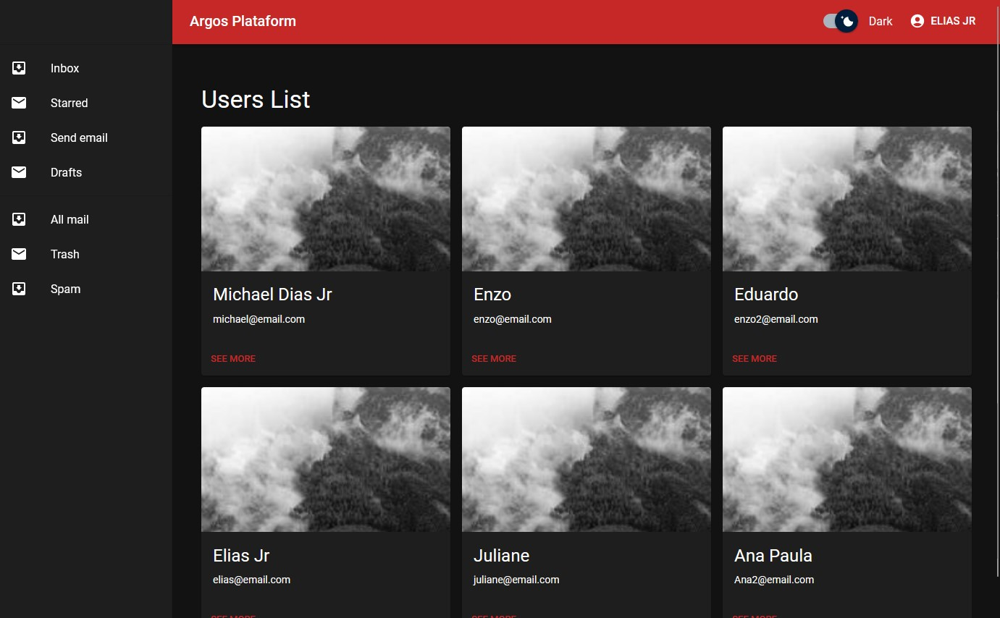

# Projeto Front-end para Autenticação de Usuários

Este projeto fornece uma base sólida e pré-configurada para o desenvolvimento de aplicativos e sistemas que requerem autenticação de usuários. Ele segue as melhores práticas e utiliza tecnologias modernas para facilitar o início do desenvolvimento.

Este Projeto é originalmente integrado com um backend desenvolvido Node. Mas pode ser integrado com qualquer API e/ou linguagem.
### Back End - Node:

```bash
https://github.com/devEliasJr/Api-Node-User-Auth-Crud
```

### Previews:
<div>
  <div></div>
  <div> </div>
</div>

## Tecnologias e Bibliotecas

- **React com Vite:** Desenvolvimento rápido e eficiente.
- **TypeScript:** Tipagem estática e segurança do código.
- **React Router DOM:** Gerenciamento de navegação e rotas da aplicação.

## Estilização e Componentes

- **Material UI:** Estilização e componentes prontos para uso que aceleram o desenvolvimento e garantem uma aparência consistente e agradável.


## Interação com API e Comunicação com Banco de Dados

- **Axios:** O Axios é usado para realizar chamadas de API e interagir com o banco de dados.

## Gerenciamento Global de Estados

- **Context API do React:** Gerenciamento de estado global para compartilhar informações entre componentes.
## Estratégia de Autenticação

- **Login via Email e Senha:** Os usuários podem autenticar-se fornecendo seu email e senha.

- **Geração do Token JWT (Access Token):** Após a autenticação bem-sucedida, um token JWT é obtido e utilizado para autorizar o acesso a recursos protegidos.

- **Persistência de Usuário e Sessão:** Os dados do usuário e a sessão são mantidos para garantir uma experiência de usuário contínua.

## Ambiente Interno do Dashboard

- **Aplicação Base Responsiva e Dinâmica:** O projeto inclui um ambiente interno de dashboard que é responsivo e dinâmico, pronto para personalizações e implementações adicionais.

- **Elementos Componentizados:** Os elementos do dashboard são componentizados para facilitar a reutilização e a manutenção do código.

- **Temas Light e Dark Pré-configurados:** Oferecemos temas claros e escuros pré-configurados para melhorar a experiência do usuário.

## Como Iniciar o Projeto

Para começar a utilizar este projeto, siga os passos abaixo:

### 1. Clone o repositório:

```bash
 git clone https://github.com/devEliasJr/Front-User-Auth .
```

### 2. Instale as dependências do projeto

```bash
 npm install
```

### 3. Instale as dependências do projeto

```bash
 npm run dev
```

### 4. O projeto estará disponivel em:

```bash
 http://localhost:5173/
```
